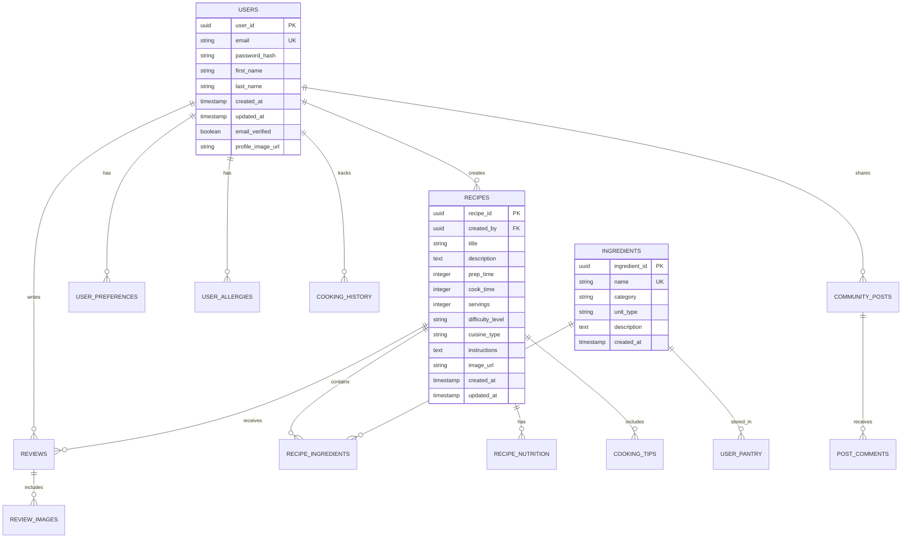

# Sous Cook - System Design & Architecture

## Table of Contents
1. [High-Level Architecture](#high-level-architecture)
2. [Current Architecture](#current-architecture)
3. [Target Firebase Architecture](#target-firebase-architecture)
4. [Component Architecture](#component-architecture)
5. [Data Flow Diagrams](#data-flow-diagrams)
6. [Database Design](#database-design)
7. [API Design](#api-design)
8. [Security Architecture](#security-architecture)

## High-Level Architecture

### System Overview
Sous Cook is a modern web application designed with a microservices-oriented architecture that provides recipe recommendations based on available ingredients. The system is designed to be scalable, maintainable, and user-friendly.


## Current Architecture

### Current Technology Stack
The application currently uses a traditional three-tier architecture:


### Current Container Architecture


## Target Firebase Architecture

### Firebase Migration Architecture
The target architecture leverages Firebase services for improved scalability and reduced infrastructure management:


## Component Architecture

### Frontend Component Structure


### Backend Service Architecture
```mermaid
graph TB
    subgraph "Express API Server (index.js)"
        ROUTER[API Endpoints]

        subgraph "Route Handlers"
            USER_AUTH[User Auth (Signup, Login, Google)]
            USER_MGMT[User Management (CRUD)]
            MENU_REC[Menu Recommendation]
            IMAGE_PROC[Image Processing (Upload, Detect)]
            DB_OPS[Database Operations (Favorites, History, Menus)]
        end

        subgraph "Middleware & Libraries"
            CORS[CORS]
            MULTER[Multer for File Upload]
            PG[node-postgres for DB connection]
            BCRYPT[Bcrypt for Hashing]
        end

        subgraph "External API Clients"
            OPENAI_CLIENT[OpenAI]
            GOOGLE_VISION[Google Cloud Vision]
            AXIOS[Axios for Edamam/Spoonacular]
            GOOGLE_AUTH_LIB[Google Auth Library]
        end
    end

    ROUTER --> USER_AUTH
    ROUTER --> USER_MGMT
    ROUTER --> MENU_REC
    ROUTER --> IMAGE_PROC
    ROUTER --> DB_OPS

    USER_AUTH --> BCRYPT
    USER_AUTH --> GOOGLE_AUTH_LIB
    USER_MGMT --> MULTER
    DB_OPS --> PG
    MENU_REC --> OPENAI_CLIENT
    IMAGE_PROC --> GOOGLE_VISION
    IMAGE_PROC --> OPENAI_CLIENT
```

## Data Flow Diagrams

### Recipe Recommendation Flow


### User Authentication Flow


### Community Sharing Flow


## Database Design

### Entity Relationship Diagram


## API Design

### RESTful API Endpoints

#### Authentication Endpoints
```
POST   /api/auth/register          - User registration
POST   /api/auth/login             - User login
POST   /api/auth/logout            - User logout
POST   /api/auth/refresh           - Refresh token
POST   /api/auth/forgot-password   - Password reset request
POST   /api/auth/reset-password    - Password reset confirmation
```

#### User Management Endpoints
```
GET    /api/users/profile          - Get user profile
PUT    /api/users/profile          - Update user profile
GET    /api/users/preferences      - Get user preferences
PUT    /api/users/preferences      - Update user preferences
GET    /api/users/allergies        - Get user allergies
PUT    /api/users/allergies        - Update user allergies
GET    /api/users/history          - Get cooking history
```

#### Recipe Endpoints
```
GET    /api/recipes                - Get recipes (with filters)
GET    /api/recipes/:id            - Get specific recipe
POST   /api/recipes                - Create new recipe
PUT    /api/recipes/:id            - Update recipe
DELETE /api/recipes/:id            - Delete recipe
POST   /api/recipes/recommend      - Get recipe recommendations
GET    /api/recipes/:id/nutrition  - Get recipe nutrition
GET    /api/recipes/:id/tips       - Get cooking tips
```

#### Ingredient Endpoints
```
GET    /api/ingredients            - Get all ingredients
POST   /api/ingredients/detect     - Detect ingredients from image
GET    /api/ingredients/search     - Search ingredients
POST   /api/ingredients/pantry     - Add to user pantry
GET    /api/ingredients/pantry     - Get user pantry
DELETE /api/ingredients/pantry/:id - Remove from pantry
```

#### Community Endpoints
```
GET    /api/community/feed         - Get community feed
POST   /api/community/posts        - Create new post
GET    /api/community/posts/:id    - Get specific post
POST   /api/community/posts/:id/like - Like/unlike post
POST   /api/community/posts/:id/comment - Add comment
GET    /api/community/users/:id/posts - Get user's posts
```

## Security Architecture

### Security Layers
```mermaid
graph TB
    subgraph "Security Layers"
        subgraph "Network Security"
            HTTPS[HTTPS/TLS via Nginx]
        end

        subgraph "Authentication & Authorization"
            BCRYPT[Bcrypt for Password Hashing]
            GOOGLE_AUTH[Google Sign-In (OAuth 2.0)]
        end

        subgraph "Data Security"
            PARAM_VALIDATION[Server-side Input Validation]
        end

        subgraph "Application Security"
            CORS[CORS Policy]
            MULTER_VALIDATION[File Type & Size Validation]
        end
    end
```

### Data Protection Flow


---

**Document Version:** 1.0  
**Last Updated:** December 2024  
**Architecture Review Date:** March 2025
